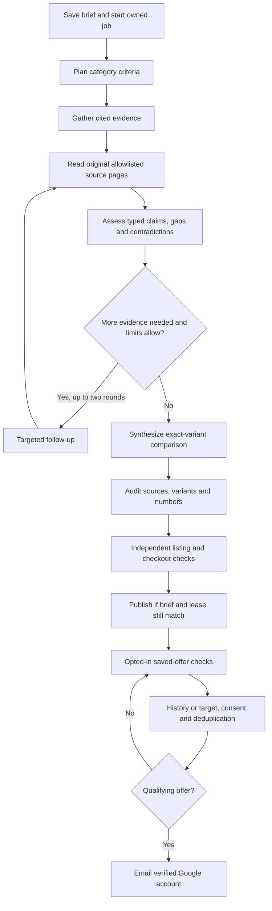

# Mirana iterative research design

Status: enhanced local implementation, 8 October 2026. Mirana now has a custom staged engine, independent source reading, a structured claim ledger, persisted jobs, safe diagnostics and an explicit local dispatcher. Final enhanced-workflow verification is in progress. The Gemini benchmark evaluates ordinary Vertex AI model calls; it does not evaluate Google's managed Deep Research agent. This iteration has not been deployed, and production configuration remains unchanged.

## What Google publicly documents

Google describes an agent that plans an investigation, formulates searches, reads results, identifies gaps and searches again before writing a cited report. Its research training uses multi-step reinforcement learning. The full internal implementation is not public, so reproducing the workflow does not reproduce Google's model training or guarantee equal quality. [Google's research-agent explanation](https://blog.google/innovation-and-ai/technology/developers-tools/deep-research-agent-gemini-api/)

The managed agent uses the Interactions API, background execution, job polling or streaming, and optional collaborative planning. It is a different product from a normal Gemini `generateContent` call with Google Search enabled. [Gemini API documentation](https://ai.google.dev/gemini-api/docs/deep-research)

For public Mirana, use a custom workflow with a suitable generally available Gemini model through Vertex AI. The current Google Cloud Deep Research preview documentation explicitly limits that offering to testing/evaluation and excludes commercial or production use. This restriction is specific to that documented Cloud preview offering; do not generalize it to every Gemini model or API. [Google Cloud agent documentation](https://docs.cloud.google.com/gemini-enterprise-agent-platform/agents/use-deep-research)

## Implemented locally

Mirana keeps its Next.js application, Google account isolation, Turso/libSQL storage and independent checkout/alert rules. New research follows `plan → gather → read → assess → followup → read → assess → synthesize → verify → publish`, with at most two follow-up rounds. Plan, discovery, assessment and synthesis use ordinary provider generation requests. Original-page reading, verification and publication make no model calls.

The default remains OpenAI Responses with `gpt-5.5`. `RESEARCH_PROVIDER=vertex` explicitly selects Vertex AI and requires `GOOGLE_API_KEY` plus `GOOGLE_CLOUD_PROJECT`; the default Gemini model is `gemini-3.8-flash`. Having Google credentials alone does not switch providers. Vertex calls use the configured project, global `generateContent`, and Google Search grounding for search stages. Neither path invokes a managed Deep Research agent.

## Stage contracts

| Stage | Current behavior |
| --- | --- |
| Plan | Separates hard requirements from soft preferences and derives category criteria, search questions, mandatory accessories and clarification needs. Includes an immutable structured brief and explicit reference date. The displayed plan is read-only in this iteration. |
| Gather | Searches official sources, Amazon India, Flipkart and relevant review/owner evidence; persists a bounded narrative, canonical source URLs and provider-associated cited text. |
| Read | Independently retrieves selected original official, retailer, review and owner pages; stores bounded plain text, direct quotes, dates, content hashes and access blockers. Reading has its own durable checkpoint. |
| Assess | Creates typed candidate claims against original page text: hard-requirement status, specifications, measurements, opinions, anecdotes, condition, availability and accessory compatibility/cost. Checks quoted text association and surfaces contradictions or unknowns. |
| Follow-up | Searches unresolved questions using saved evidence; at most two rounds. It does not restart the initial investigation. |
| Synthesize | Produces the strict report schema with at most top N, constrained by the validated claim ledger. Removes candidates contradicted on hard requirements, combined storage variants, unsupported comparison claims and unsuitable offers; preserves provisional candidates and evidence gaps. |
| Verify | Reuses independently read allowlisted listing data and optional authenticated merchant receipts. It clears stale checkout flags before refreshing them. Unknown complete-kit costs remain null. |
| Publish | Commits only while the owner, brief revision/hash and research lease remain current. A failed new run does not replace an existing published report. |

Hard budget, top N and postcode override conflicting free text. Preference presets and custom tags affect ranking after hard requirements. Tags, pages and product links are untrusted data; no sensitive personality inference is made. Top N is a maximum, so a sparse or empty comparison is valid when evidence is inadequate.

## Discovery, original documents and claim evidence

Discovery stores canonical URLs and provider-associated citation/grounding excerpts. Those generated excerpts are leads, not independently read original-document evidence. Gemini redirect URLs are canonicalized only through Google's fixed redirect service; its destination is not automatically fetched.

The separate `read` stage selects original pages with official/retailer/review/owner diversity. It uses exact approved manufacturer/retailer hostnames and exact Notebookcheck, RTINGS, GSMArena, TrustedReviews, AndroidAuthority and Reddit host variants. Arbitrary user URLs, private addresses, credentials in URLs and unapproved hosts are rejected. A supplied product link can influence discovery but cannot expand the reader allowlist.

Each reading round accepts at most 12 sources with concurrency three, an eight-second per-source deadline and a one-MiB streamed-body cap. HTML and JSON are supported; PDFs are recorded as unsupported. Redirects are observed and blocked, never followed. Requests omit cookies and authorization, use a fixed user agent and do not bypass CAPTCHA or login gates. Blocked, timed-out, unsupported, disallowed and failed reads retain a fixed safe reason without invented body text.

Readable extraction prefers article/main content and removes scripts, styles, navigation, explicit sign-in forms, interactive field values and known hidden sections; readable no-JavaScript fallback and product-form text are retained. It is bounded text extraction rather than a full browser renderer. Stored original text remains untrusted data and may be incomplete. Limits are 12000 text characters per source and 36000 per round, with at most 1200 direct-quote characters per source and 6000 per round. Every snapshot records retrieval time, a publication date when extractable and valid, and SHA-256 of the exact stored body after truncation. Quote character ranges refer to that stored text; truncation is explicit.

Assessment creates a candidate claim ledger using only independently read text. Hard requirements are `supported`, `contradicted` or `unknown`; soft preferences remain secondary. Mandatory accessories cover named functional requirements, so one actual stylus can cover the generic stylus slot. Conditional adapters remain investigation questions until evidence establishes that they are required. An all-unknown lead cannot become a shortlist recommendation. Comparison claims distinguish specifications, measured results, professional opinions and owner anecdotes. Mandatory accessory compatibility and price can cite separate sources. Quotes must match the original stored text, hash and dates and associate with the exact model/variant. Missing required accessory costs produce an unknown required-kit cost; known over-budget, used/refurbished, incompatible or out-of-stock contradictions block a candidate where applicable.

Strict provider envelopes and local runtime validation enforce allowed enums, required properties, numeric/string/array bounds where specified and bounded candidate/claim collections. Published reports include compact claim status and source references, not raw page bodies or quote collections. Retailer-label, exact-variant, India-market, numeric and listing-path guards remain additional checks. Tracker/news URLs cannot masquerade as current Amazon or Flipkart offers.

Quote location proves original-text association, not factual truth. Models can still misunderstand a statement, miss a requirement, choose a weak source or make an incorrect semantic assessment. A price quotation cannot establish seller reliability, postcode delivery, taxes, shipping or checkout eligibility. Measured claims require attributable methodology; owner anecdotes do not establish failure rates. Evidence gaps, provisional status, exclusions and clarifications must remain visible.

## Persistent execution and limits

`research_jobs` stores owner/purchase, immutable brief revision/hash, reference date, stage, status, limits, attempted calls, returned usage, lease token/expiry, retry time and a bounded payload. The payload contains completed outputs, serialized source-reading checkpoints, a stage journal, a structured claim ledger and fixed public progress events. Raw source bodies and proof quotes stay server-side. There are no separate `research_steps`, `research_sources` or `research_claims` tables in this iteration.

A 240-second per-job lease and transactional fenced writes reject stale workers. Ownership and the current brief are checked before stages and publication. Cancellation prevents later checkpoints and publication; an already sent provider request can still finish or be billed. Retry resumes saved completed stages and keeps attempted-call limits. Transient provider failures use a retry time 60 seconds ahead; eligible work resumes on a later dispatcher invocation. A provider call interrupted before its checkpoint can be repeated and billed again, so external calls are not exactly once.

| Control | Default | Maximum |
| --- | ---: | ---: |
| `RESEARCH_MAX_CALLS` | 8 attempted generation calls per job | 8 |
| `RESEARCH_MAX_ROUNDS` | 2 follow-up rounds | 2 |
| `RESEARCH_MAX_INPUT_TOKENS` | 100000 | 200000 |
| `RESEARCH_MAX_OUTPUT_TOKENS` | 24000 | 48000 |
| `RESEARCH_STEP_TIMEOUT_MS` | 120000 ms | 180000 ms, minimum 10000 |
| `RESEARCH_MAX_JOBS` | 1 job per dispatcher invocation | 2 |

Each generation has a 6000-token output ceiling. The worker has a 200-second invocation budget inside the 240-second route limit. It leaves insufficiently timed work queued for the next dispatch. Input reservations are conservative estimates; provider search context and failed calls can have unreturned usage. Token estimates and attempted-call limits are operational controls, not a guaranteed invoice ceiling. Public-account fairness and larger-scale queue capacity require further work.

## UI, API and WebMCP

Authenticated `POST /api/research` creates or reuses an owned queued job and requests a wake-up through Next.js `after()`. `GET /api/research?purchaseId=...` returns safe persisted progress, plan criteria/questions, source counts and gaps. `PATCH /api/research` supports `cancel` and `retry`. The interface reconnects to saved progress after refresh; public events never expose hidden reasoning, provider payloads or secrets.

WebMCP offers `start_research`, `read_research_job`, `cancel_research` and `retry_research`, alongside the existing item/report tools. Editing or approving a research plan is not implemented. Refreshing progress alone does not guarantee worker execution.

## Safe research diagnostics

`RESEARCH_LOG_LEVEL=info` emits structured server diagnostics prefixed `mirana_research`; set it to `off` to disable them. `debug` has the same privacy boundary as `info` and does not reveal additional payloads. Logs include a SHA-256 job correlation hash, known stage/event names, elapsed time, attempted-call/round limits, bounded source/gap/candidate counts, provider/model and returned usage. The `read` stage is logged alongside model stages without consuming a generation attempt.

Error diagnostics use known generic codes rather than arbitrary exception messages. Logs omit account identities, emails, shopping text, prompts, page URLs/bodies, headers, credentials, provider response bodies and hidden model reasoning. Usage numbers are operational measurements; incomplete/failed calls can have unreturned usage. Public progress events are fixed safe messages, not the model's internal reasoning.

## Local and production dispatch

Run `npm run worker:local` explicitly in a separate terminal after choosing a local `file:` database and applying migrations. It loads `.env.local`, rejects hosted database URLs and production/Vercel execution, and loops with a five-second pause between completed dispatches. It can make billable provider calls, so it is not automatically started with the development server.

`after()` is a wake-up opportunity; persistence does not make it a continuous execution service. The checked-in Vercel Hobby cron remains daily and cannot guarantee timely continuation of multi-stage jobs or honor 12-hour/hourly alerts. A reliable frequent production dispatcher is unresolved and must be configured and verified before release. The local dispatcher must not be used against production data.

## Scheduled checks and remaining release work

Due opted-in watches revisit saved exact variants and listing URLs through `refreshSavedOffers`; they do not run an LLM or broad candidate discovery. Fresh independent observations, complete merchant receipts, budget, target/history, current consent and deduplication govern emails. No qualifying offer means no email. Google, provider, checkout-adapter and email readiness must be verified separately.

Before public release: complete enhanced-workflow verification and re-benchmark the new workflow, validate retrieval and semantic evidence quality across categories, verify sustained dispatcher/crash recovery and capacity, test actual merchant receipts and qualifying email delivery, and harden provider access for production. Mocked engine/job/worker tests establish local contracts, not live end-to-end quality. Keep the existing production app and legacy private Site intact until the user requests and validates a release.

The earlier isolated four-call Vertex smoke test ran before independent reading and the claim ledger. Its 23 discovery sources and one provisional candidate do not validate this enhanced iteration. See [LOCAL_RESEARCH_VERIFICATION.md](LOCAL_RESEARCH_VERIFICATION.md) for the distinction and remaining checks.

## Recovery and evidence audit follow-up (8 October 2026)

Read-context allocation gives every readable selected page a fair share before hashing and quoting the stored snapshot. A completed assessment can be retained when a later assessment or follow-up would exhaust the final-report budget. The saved job journals the skipped stage, retains later unassessed sources as leads, carries the gap into synthesis, and preserves attempted-call/token accounting across explicit retries. Follow-up counts are upper bounds; they do not promise two completed rounds under every token budget.

Suitability requires attributable use-case or comparison evidence; a market, condition or price check alone cannot justify a shortlist or #1. Warranty text cannot establish pressure/palm support or new condition. Bank eligibility remains unknown from a displayed price alone. Short first-price quotes on exact-SKU retailer pages preserve attribution, while later carousel amounts remain rejected. These guards reduce observed errors; they are not a general semantic truth verifier. The latest live-study offline audit produced no dependable shortlist and remains a release-quality gap.
